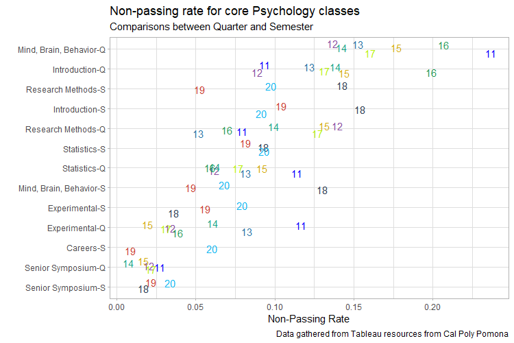

```{r setup, include=FALSE}
knitr::opts_chunk$set(echo = TRUE)

library(tidyverse)
library(xaringanthemer)
style_duo(primary_color = '#56B4E9', secondary_color = 'black')
```

# Agenda

- Introductions
- The Scientific Method

---

# About Me

.pull-left[

]

.pull-right[
- My name is Jonathan A. Pedroza (he/him)
  - please refer to me as **JP** unless around other instructors/faculty
  
- First-generation Graduate
  - CPP Alumni (2014)
  - CSUDH (2017)
  - University of Oregon (2021)
]

---

.pull-left[

]

.pull-right[


- Hobbies include: fishing, hiking, cooking, and coffee
]

---

# Nerdy Stuff

.pull-left[
- Passion/Nerdy Topics:
  - I love creating data visualizations in `R`
  - health inequities in communities of color
  - examining environmental variables that influence health behaviors
]

.pull-right[

]

---

# Tell Me About Yourself

- Name, Activity Section, and pronouns

- What do you want to do after you graduate?

- What is your experience with statistics and SPSS?

- What is your experience with conducting research?

- Name a topic/area of interest for you that you would want to 

---

# Acquiring Knowledge

.pull-left[
- **Methods of acquiring knowledge** are ways in which we know things or discover answers to questions

- The issue becomes what ways of acquiring knowledge are valid and reliable
  - we'll learn about these topics down the line
]

.pull-right[
- [*Wikipedia*](https://en.wikipedia.org/wiki/Main_Page)

- Facebook

- [*Reddit*](https://www.reddit.com/r/todayilearned/)
]

---

# Would you consider this a "Good Source of Knowledge"?

- Peer-review journal article on effectiveness of vaccinations

- Uncle's Facebook rank on effectiveness of vaccinations

- Publication from drug company on medication's effectiveness

- JP's slides

---

# Method of Tenacity

- **Method of tenacity** is when information is accepted because it has been accepted as fact for a long period of time or due to superstition

- Some examples include:
  - breaking a mirror gets you bad luck
  - Depression is all in your head
  - only boys show signs of ADHD
  - Napolean Bonaparte was short
  - We only use 10% of our brains
  - having a glass of wine is good for your health

---

# Method of Intuition

- **Method of intuition** is when information is accepted because it feels right
  - essentially relying on instinct

 
  
---

# Method of Authority

- **Method of authority** is when information is accepted because the source is an expert in the area
  - issue is that people take this information without researching the topic themselves
  - also sometimes we perceive people as *experts* when they are not

- Examples include:
  - JP telling you that this is a method of accepting information
  - JP's mom telling him that chicken soup will make him feel better
  - JP's mother-in-law telling him to take `Emergen-C`
  
---

# Method of Faith

- Within the method of authority, **method of faith** is when people accept information from an authority figure without doubt based on their faith
  - based on a form of sacred text and an authority figure within that context (faith/religion/spirituality)
  


---

# The Rational Method

- The **rational method** or **rationalism** is when someone seeks answers by rational thinking

- You experience this any time you take a multiple choice exam.
  - If you come up with an answer rationally you are using what method:
    
    * Method of authority
    * Method of Faith
    * The Empirical Method
    * The Rational Method
    
---

# The Rational Method

- When facts or assumptions are presumed to be true, they are **premise statements**

- An **argument** is a set of premise statements that are logically combined to reach a conclusion

- Example:
  - In fall/winter months, there is more consumption of ham.
  - In fall/winter months, there are more DUI collisions.
  - Eating mass quantities of ham cause DUI collisions.
  


---

# The Rational Method

- Issues with this method are that people don't consider other possibilities

- For the example on the previous slide, what may be other causes and conclusions?

- Does not include direct observation or actively gathering information/data

---

# The Empirical Method

- The **empirical method** or **empiricism** uses observations or other observable information to obtain knowledge and draw conclusions

- Some examples could be:
  - Does it snow in Pomona?
  - CPP is a diverse campus?

- If you've ever googled something a professor said to see if they are wrong, then you have relied on the empirical method

---

# The Scientific Method

- The **scientific method** is an approach to acquiring knowledge through steps from formulating questions to finalizing conclusions
  - uses several other steps that we previously learned

- Steps to the scientific method
  1. Observation
  2. Form question/hypothesis
  3. Test hypothesis and collect data
  4. Analyze and evaluate data 
  5. Draw conclusions

---

# Observations

- Start with a general observation

- Example:
  - When I walk around my neighborhood I realize there are not many parks; these parks also lack amenities. When I go to higher income neighborhoods, there are several parks with great amenities. 
  
- In this example, **inductive reasoning** is used
  - By relying on small number of instances where I noticed a pattern, I created a general statement about a possible larger phenomenon
  - Use a small number of data to reach conclusions about larger implications
  
---

# Form a tentative question/hypothesis

- From the experiences you have observed, draw a potential conclusion
  - A **research question** is often used here --> **hypothesis**

- This often begins with thinking about what variables should be considered
  - **Variables** are characteristics/conditions that have different values in different individuals (or other units of measurement)

- Example:
  - What may lead to difference in the number and access to parks? (Research Question)
  - Does income differences in neighborhoods lead to differing numbers of parks? (Research Question)
  - Lower incomes are associated with less parks. (Hypothesis)
  
--- 

# Form a tentative question/hypothesis

- A **hypothesis** is a declarative statement describing the association between **two** variables
  - A **research question** is the starting point for thinking about the potential association between two variables

- Lower incomes (**Income**) are associated with less parks (**Number of parks**).

---

# Test hypothesis and collect data

- Then you would create a scenario/experiment to test your hypothesis
  - Example: Go around different neighborhoods that are considered low and high incomes to see how many parks each neighborhood has
  
- **Deductive reasoning** uses a general statement as the basis for reaching a conclusion about specific examples
  - Use your hypothesis to reach a conclusion about your small sample/specific example
    * See in the two neighborhoods you are interested in if there are differences in parks
  
---

# Analyze and evaluate data 

- use past research and your own data collection to use for conclusions

- make sure not to bias responses
  - use operational definitions (standardized definitions) to make sure you are measuring the correct construct
    * Parks = grass, water fountain, public restroom, 1 sports field (baseball diamond, basketball court, tennis court)

- Example:
  - The data shows that the average number of parks in high income neighborhoods is 3.4. It also shows that the average number of parks in low income neighborhoods is 1.1
  
---

# Draw conclusions

- Compare your hypothesis to what your data showed

- Was your hypothesis correct?

- What was the finding?

- Is it still important to know about, even if you were wrong?

---

# Draw Conclusions


---

# Draw Conclusions

- This is the basis of all research

- From your findings (1 research study), you keep adapting and moving forward learning more intricate details about the association/phenomenon you are interested in

- Then you make a career out of that and you never leave your office


---

# Science is...

- Empirical
  - Be systematic
  - Rather than go into something without knowing about that topic, we refer to the literature
  - "Refer to the literature" or "Well, what does the literature say"
  
---

# Science is...
  
- Public
  - should be published for "all" to see
    * Not really what happens
  - Should be able to be replicated
  - **Replication** is the repetition of observation
  - Importance of a good `Method` section

---

# Science is...

- Objective
  - The researcher or participant should not bias the finding results
  - p-hacking
  - constantly running a number of tests until finding something "significant"
